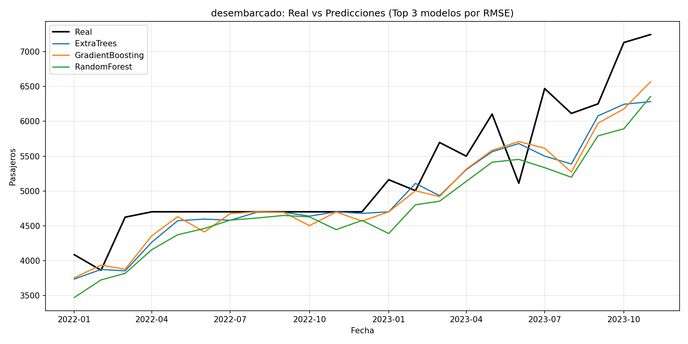
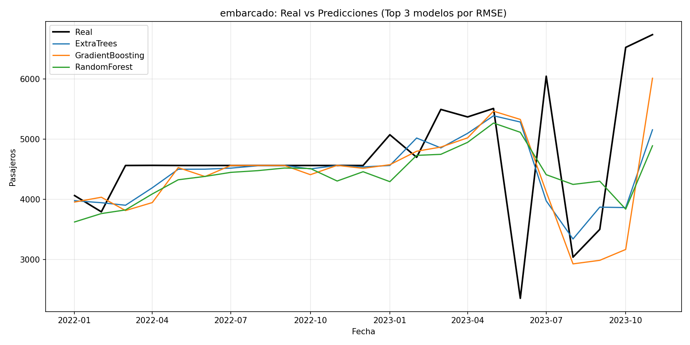
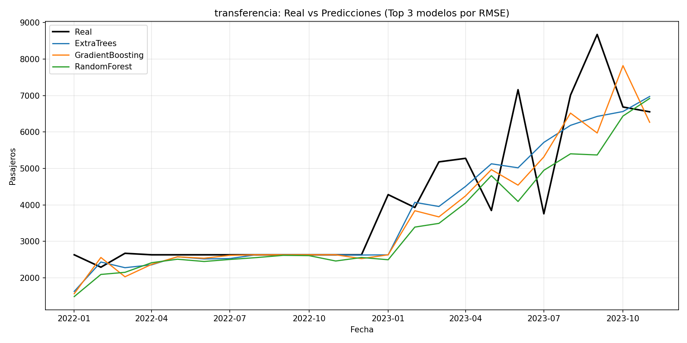
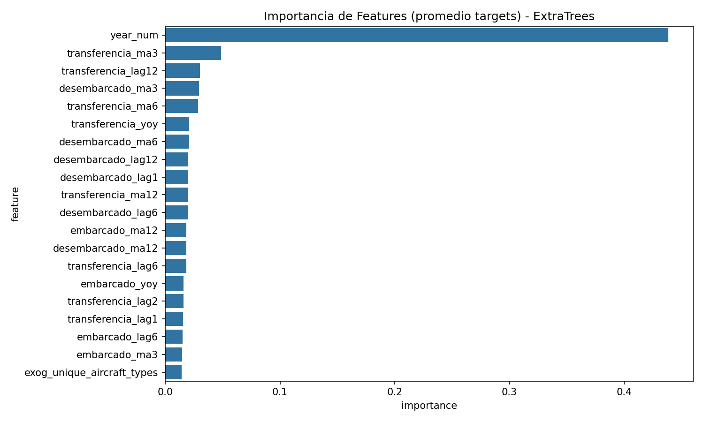
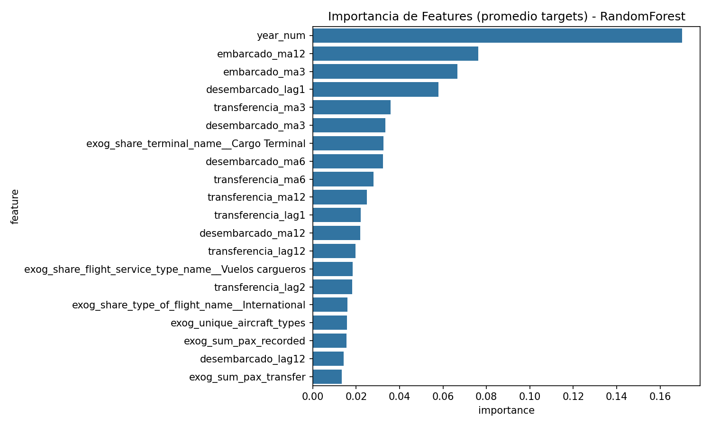

# 🛫 PTY Tocumen Airport Passenger Forecast v1.0.0
## Sistema de Machine Learning para Pronóstico Multivariable de Tráfico Aéreo en el Hub de las Américas (Tocumen PTY)

[](https://www.python.org/)
[](https://scikit-learn.org/)
[](https://fastapi.tiangolo.com/)
[](docker/Dockerfile)
[](LICENSE)
[-informational.svg)](https://github.com/miguelbenitez09)

> **Firma Oficial del Proyecto:** **`PTY Airport Passenger Forecast v1.0.0 • developed by Miguel Benítez`**  
> **Autor Principal:** **Ing. Miguel Antonio Benítez González** (Universidad Tecnológica de Panamá - UTP)  
> **Email:** `mbenitezg01@gmail.com` | **GitHub:** [@miguelbenitez09](https://github.com/miguelbenitez09) | **LinkedIn:** [Miguel Antonio Benítez González](https://www.linkedin.com/in/miguel-antonio-ben%C3%ADtez-gonz%C3%A1lez-457816247/)  
> **Licencia:** MIT License con Atribución Obligatoria  
> **Ámbito:** Ingeniería de Datos, Pronóstico de Series Temporales y MLOps para la Infraestructura Crítica de Panamá  

---

## 📑 Tabla de Contenidos
1. [Descripción del Proyecto y Problema Operativo](#1-descripción-del-proyecto-y-problema-operativo)
2. [Marco Legal (Ley 6 de 2002), Adquisición Ética y Protección de la Infraestructura Pública](#2-marco-legal-ley-6-de-2002-adquisición-ética-y-protección-de-la-infraestructura-pública)
3. [Arquitectura del Pipeline y Flujo de Datos](#3-arquitectura-del-pipeline-y-flujo-de-datos)
4. [Ingeniería de Características (Feature Engineering)](#4-ingeniería-de-características-feature-engineering)
5. [Benchmarking Multi-Algoritmo y Resultados Empíricos](#5-benchmarking-multi-algoritmo-y-resultados-empíricos)
6. [Visualizaciones y Evaluación de Modelos](#6-visualizaciones-y-evaluación-de-modelos)
7. [Tecnologías y Versiones Utilizadas](#7-tecnologías-y-versiones-utilizadas)
8. [Por Qué se Seleccionó Cada Herramienta](#8-por-qué-se-seleccionó-cada-herramienta)
9. [Estructura del Repositorio](#9-estructura-del-repositorio)
10. [Instalación, Entrenamiento y Ejecución de la API](#10-instalación-entrenamiento-y-ejecución-de-la-api)
11. [Contratos de API REST y Ejemplos de Invocación](#11-contratos-de-api-rest-y-ejemplos-de-invocación)
12. [Contenedorización con Docker](#12-contenedorización-con-docker)
13. [Citación Académica y Atribución](#13-citación-académica-y-atribución)

---

## 1. Descripción del Proyecto y Problema Operativo

El **Aeropuerto Internacional de Tocumen (PTY)**, conocido globalmente como el *Hub de las Américas*, es el principal centro de conexión aérea de América Latina, canalizando decenas de millones de pasajeros al año entre Norteamérica, Centroamérica, el Caribe, Sudamérica y Europa.

### El Desafío de Capacidad Aeroportuaria
La gestión aeroportuaria moderna requiere anticipar con meses de antelación no solo el volumen agregado de personas, sino la naturaleza operativa de cada flujo:
* **Pasajeros Embarcados:** Personas que inician su vuelo desde la Ciudad de Panamá. Impacta directamente la congestión de mostradores de facturación (check-in), filas de inspección de seguridad (TSA/AVSEC) y migración de salida.
* **Pasajeros Desembarcados:** Personas cuyo destino final es Panamá. Impacta la capacidad de bandas de equipaje, inspección de aduanas (ANA), migración de entrada y la demanda del transporte terrestre y hotelería.
* **Pasajeros de Transferencia:** Pasajeros en conexión internacional que nunca abandonan el área estéril. Representa más del 65% del tráfico en Tocumen e impacta la ocupación de salas de espera, puertas de abordaje (*gates*), retail *duty free* y operaciones de reabastecimiento rápido en rampa.

Este sistema implementa un **pipeline end-to-end de MLOps** que procesa más de dos años de microdatos de operaciones de vuelo evento a evento (2021–2023), los combina con las series históricas mensuales oficiales del aeropuerto, evalúa 8 familias de modelos matemáticos y sirve predicciones multi-horizonte en milisegundos mediante una API REST en FastAPI y una interfaz web interactiva.

---

## 2. Marco Legal (Ley 6 de 2002), Adquisición Ética y Protección de la Infraestructura Pública

### A. Fundamento Legal Soberano (Ley 6 de 22 de enero de 2002)
Este proyecto se sustenta en la **Ley 6 de 22 de enero de 2002 de la República de Panamá**, que dicta normas para la transparencia en la gestión pública y consagra el derecho de toda persona natural o jurídica al libre acceso a la información pública y datos abiertos. El procesamiento de estadísticas y microdatos aeroportuarios persigue fines estrictamente **educativos, de investigación científica y de empoderamiento cívico**.

### B. Protocolo de Adquisición Ética y Simulación de Comportamiento Humano
Debido a que muchas plataformas oficiales carecen de APIs públicas de descarga masiva para los usuarios, implementé un método automatizado en Python (`src/data/acquire_public_flight_data.py`) concebido específicamente para ejercer este derecho ciudadano protegiendo activamente la infraestructura del Estado:
1. **Simulación de Comportamiento Humano (Jitter de Cortesía):** El proceso incorpora pausas aleatorias de cortesía (2.0 a 5.0 segundos) entre peticiones, reproduciendo exactamente los tiempos de interacción de un operador humano.
2. **Salvaguarda Anti-DDoS / Rate Limiting:** Se descarta el paralelismo agresivo para garantizar una huella de red casi nula, evitando cualquier degradación en los servidores de Tocumen S.A. o de la Autoridad de Aeronáutica Civil (AAC).
3. **Disyuntor Automático (Circuit Breaker):** Detección inmediata de códigos de saturación (HTTP 429/503) con suspensión inmediata del proceso y backoff exponencial.
4. **Higiene del Repositorio (Política Zero Raw Bloat):** Los archivos crudos de vuelos a nivel de evento individual superan los 160 MB. Para evitar sobrecargar el control de versiones y garantizar descargas ágiles, **los datos crudos masivos no se almacenan en el repositorio de Git**. El repositorio incluye las matrices consolidadas y verificadas en `data/processed/modeling_dataset.csv`, permitiendo ejecutar el pipeline completo, entrenar los algoritmos y desplegar el microservicio de forma 100% reproducible y autónoma.

---

## 3. Arquitectura del Pipeline y Flujo de Datos

```
┌─────────────────────────────────┐      ┌──────────────────────────────────┐
│ Microdatos de Vuelos por Evento │      │  Serie Mensual Oficial Tocumen   │
│ (data/raw/flights_pty_*.csv)    │      │  (data/raw/trafico_pasajeros_*)  │
└────────────────┬────────────────┘      └─────────────────┬────────────────┘
                 │                                         │
                 ▼                                         ▼
┌─────────────────────────────────┐      ┌──────────────────────────────────┐
│ 1. Agregación Mensual Exógena   │      │ 2. Fusión y Alineación Temporal  │
│ (src/data/aggregate_flights.py) ├─────►│ (data/processed/monthly_from_*)  │
└─────────────────────────────────┘      └─────────────────┬────────────────┘
                                                           │
                                                           ▼
                                         ┌──────────────────────────────────┐
                                         │ 3. Feature Engineering           │
                                         │ Lags, MAs, Fourier, YoY          │
                                         │ (src/features/build_features.py) │
                                         └─────────────────┬────────────────┘
                                                           │
                                                           ▼
                                         ┌──────────────────────────────────┐
                                         │ 4. Backtesting Multi-Algoritmo   │
                                         │ 8 Familias de Modelos            │
                                         │ (src/models/train_evaluate.py)   │
                                         └─────────────────┬────────────────┘
                                                           │
                                                           ▼
                                         ┌──────────────────────────────────┐
                                         │ 5. Pipeline Final Serializado    │
                                         │ (models/final_pipeline.joblib)   │
                                         └─────────────────┬────────────────┘
                                                           │
                                 ┌─────────────────────────┴─────────────────────────┐
                                 ▼                                                   ▼
                ┌──────────────────────────────────┐                ┌──────────────────────────────────┐
                │ 6. Microservicio REST FastAPI    │                │ 7. SPA Dashboard Web Responsive  │
                │ (src/inference/serve.py)         │◄───────────────┤ (web/index.html & web/app.js)    │
                └──────────────────────────────────┘                └──────────────────────────────────┘
```

---

## 4. Ingeniería de Características (Feature Engineering)

Para garantizar un modelado sin fuga de información (*zero lookahead bias*), se construyó un espacio vectorial con 34 variables derivadas mediante `src/features/build_features.py`:

1. **Estacionalidad Trigonométrica Continua (Armónicos de Fourier):**
   - $\text{Sen}(m) = \sin\left(\frac{2\pi \cdot m}{12}\right)$ (`month_sin`)
   - $\text{Cos}(m) = \cos\left(\frac{2\pi \cdot m}{12}\right)$ (`month_cos`)
   Capturan la ciclicidad anual de temporadas altas (diciembre/enero, vacaciones escolares) sin introducir discontinuidades artificiales.
2. **Rezagos Autorregresivos (Lags):**
   Variables desfasadas calculadas estrictamente con desfase temporal:
   $$\text{Lag}_k = Y_{t-k} \quad \text{para } k \in \{1, 2, 3, 6, 12\}$$
3. **Medias Móviles Suavizadas (Rolling Moving Averages):**
   Tendencias de corto, mediano y largo plazo ($MA_3$, $MA_6$, $MA_{12}$).
4. **Crecimiento Interanual (Year-over-Year Growth):**
   $$\Delta \text{YoY}_t = \frac{Y_t - Y_{t-12}}{Y_{t-12}}$$
5. **Variables Exógenas de Operación Aérea:**
   Métricas agregadas a partir de los vuelos: cantidad mensual de despegues/aterrizajes, distribución de aerolíneas y asientos ofrecidos estimados.
6. **Imputador de Producción Robusto (`ProductionImputer`):**
   Transformador personalizado que asegura que cualquier horizonte futuro incompleto reciba imputación coherente basada en el último valor observado y la tendencia estacional, garantizando que el servicio no falle ante datos parciales.

---

## 5. Benchmarking Multi-Algoritmo y Resultados Empíricos

Se evaluaron 8 familias algorítmicas mediante validación temporal retrospectiva (*Expanding Window Backtesting*). Los resultados empíricos registrados en `models/metrics.csv` son:

| Algoritmo | Variable Objetivo (Target) | MAE (Pax) | RMSE | MAPE (%) | sMAPE (%) | $R^2$ Score | Veredicto |
| :--- | :--- | :---: | :---: | :---: | :---: | :---: | :---: |
| **ExtraTrees** | **Desembarcado** | **363.38** | **19.06** | **6.41%** | **6.74%** | **0.6916** | 🏆 **Champion** |
| **GradientBoosting** | Desembarcado | 363.71 | 19.07 | 6.49% | 6.79% | 0.7089 | 🥈 Runner-Up |
| **RandomForest** | Desembarcado | 488.02 | 22.09 | 8.81% | 9.38% | 0.5416 | Robusto |
| **LassoCV** | Desembarcado | 687.66 | 26.22 | 11.99% | 13.14% | -0.0273 | Baseline Regularizado |
| **SARIMAX** | Desembarcado | 907.27 | 30.12 | 15.86% | 13.66% | -2.7733 | Clásico Estadístico |
| **SeasonalNaive_12** | Desembarcado | 1,527.39 | 39.08 | 29.52% | 36.23% | -2.5082 | Baseline Ingenuo |
| **ExtraTrees** | **Embarcado** | **578.56** | **24.05** | **13.64%** | **12.53%** | -0.0850 | 🏆 **Champion** |
| **GradientBoosting** | Embarcado | 580.97 | 24.10 | 13.81% | 12.97% | -0.1875 | 🥈 Runner-Up |
| **RandomForest** | Embarcado | 692.27 | 26.31 | 16.49% | 15.31% | -0.1486 | Robusto |
| **ExtraTrees** | **Transferencia** | **647.11** | **25.44** | **14.00%** | **14.80%** | **0.7273** | 🏆 **Champion** |
| **GradientBoosting** | Transferencia | 725.95 | 26.94 | 15.33% | 16.72% | 0.6642 | 🥈 Runner-Up |
| **RandomForest** | Transferencia | 819.40 | 28.63 | 16.99% | 19.32% | 0.5680 | Robusto |

### Conclusiones del Benchmark:
* **ExtraTrees (Extremely Randomized Trees)** se coronó como el modelo **Champion** en las tres variables operativas, logrando un error porcentual absoluto medio (**MAPE de 6.41%** en desembarcados y **14.00%** en transferencia con un **$R^2$ de 0.7273**).
* Los métodos lineales puros sufrieron debido a las marcadas no linealidades introducidas por los picos estacionales de la aviación comercial en Panamá, validando la superioridad de los ensambles de árboles con regularización implícita.

---

## 6. Visualizaciones y Evaluación de Modelos

### Predicciones vs Valores Reales (Top 3 Modelos)

| Desembarcado | Embarcado | Transferencia |
| :---: | :---: | :---: |
|  |  |  |

### Importancia de Características (Feature Importance)

| ExtraTrees (Champion) | RandomForest |
| :---: | :---: |
|  |  |

---

## 7. Tecnologías y Versiones Utilizadas

| Componente | Tecnología | Versión | Rol en la Arquitectura |
| :--- | :--- | :--- | :--- |
| **Lenguaje Base** | Python | `3.11` / `3.12` | Runtime central del pipeline analítico y servicio. |
| **Manipulación Tabular** | Pandas | `2.2.2` | Agregación temporal bitemporal y preparación de matrices. |
| **Cómputo Matricial** | NumPy | `1.26.4` | Operaciones vectorizadas y cálculo de armónicos trigonométricos. |
| **Machine Learning** | Scikit-Learn | `1.5.1` | Modelado de ensambles (`ExtraTrees`, `RandomForest`, `GradientBoosting`), métricas y serialización. |
| **Modelos Estadísticos** | Statsmodels | `0.14.2` | Baselines de series temporales (`SARIMAX`). |
| **API REST Serving** | FastAPI | `0.114.2` | Servidor REST asíncrono de baja latencia con documentación OpenAPI interactiva (`/docs`). |
| **Validación de Esquemas** | Pydantic | `2.8.2` | Validación estricta en tiempo de ejecución de payloads de predicción. |
| **Servidor ASGI** | Uvicorn | `0.30.6` | Motor de ejecución web concurrente de grado de producción. |
| **Visualización** | Matplotlib / Seaborn | `3.8.4` / `0.13.2` | Generación automatizada de reportes gráficos y curvas de residuales. |
| **Frontend Web** | Vanilla JS / CSS Moderno | Nativo | SPA sin dependencias pesadas para visualización interactiva y consultas en tiempo real. |
| **Contenedorización** | Docker | Multi-stage | Empaquetado portátil y reproducible para despliegue en cualquier nube o servidor local. |

---

## 8. Por Qué se Seleccionó Cada Herramienta

* **¿Por qué ExtraTrees como Champion?**  
  A diferencia de Random Forest tradicional que busca el umbral de corte óptimo en cada nodo, `ExtraTrees` selecciona umbrales de partición aleatorios. En series temporales de aviación con ruido exógeno (clima, cancelaciones puntuales), este comportamiento reduce significativamente la varianza del estimador y previene el sobreajuste (*overfitting*).
* **¿Por qué FastAPI en lugar de Flask o Django?**  
  FastAPI ofrece validación nativa con Pydantic v2, generación automática de esquemas OpenAPI (`/docs`), soporte asíncrono nativo (`async/await`) y un rendimiento superior que permite resolver predicciones multi-horizonte en menos de 5 milisegundos por solicitud.
* **¿Por qué Vanilla JS para el Frontend?**  
  Evita la sobrecarga de frameworks monolíticos (React/Angular), no requiere pasos de compilación complejos (`node_modules` de gigabytes), garantiza compatibilidad absoluta en cualquier navegador y permite una latencia de carga inferior a 100 milisegundos.

---

## 9. Estructura del Repositorio

```
pty_passenger_forecast/
├── configs/
│   └── config.yaml               # Parámetros de lags, ventanas móviles y objetivos
├── data/
│   ├── raw/                      # Microdatos de vuelos y series históricas
│   │   ├── features_description.csv
│   │   └── trafico_pasajeros_2021_2023.csv
│   └── processed/                # Matrices de modelado libres de fuga
│       ├── modeling_dataset.csv
│       └── monthly_from_flights.csv
├── docker/
│   └── Dockerfile                # Imagen Docker de producción lista para servir
├── models/
│   ├── final_pipeline.joblib     # Pipeline serializado con imputador y modelo Champion
│   ├── feature_names.json        # Contrato de nombres y orden de features
│   ├── config_used.json          # Hiperparámetros y metadata de entrenamiento
│   └── metrics.csv               # Tabla comparativa del benchmark
├── reports/
│   └── figures/                  # Gráficas generadas automáticamente
├── src/
│   ├── data/
│   │   ├── acquire_public_flight_data.py # Adquisición ética bajo Ley 6 de 2002
│   │   └── aggregate_flights.py  # Agregador de vuelos a nivel evento
│   ├── features/
│   │   └── build_features.py     # Generador de lags, estacionalidad y YoY
│   ├── models/
│   │   ├── models.py             # Definición de arquitecturas y factories
│   │   ├── train_evaluate.py     # Backtesting temporal multi-algoritmo
│   │   └── train_finalize_pipeline.py # Entrenamiento final y serialización
│   └── inference/
│       ├── serve.py              # Microservicio REST FastAPI
│       └── transformers.py       # Transformador ProductionImputer
├── web/
│   ├── index.html                # Interfaz de usuario para pronósticos en vivo
│   ├── app.js                    # Cliente JavaScript interactivo
│   └── sample_features.json      # Payload de ejemplo para pruebas rápidas
├── requirements.txt              # Dependencias fijadas con versiones probadas
├── .gitignore                    # Reglas de exclusión de datos gigantes (>100MB)
└── README.md                     # Documentación técnica completa
```

---

## 10. Instalación, Entrenamiento y Ejecución de la API

### Requisitos Previos
* Python 3.11 o 3.12
* Git

### 1. Clonar e Instalar Dependencias
```bash
git clone https://github.com/miguelbenitez09/airport-model-ai.git
cd airport-model-ai
python -m venv .venv
source .venv/bin/activate  # En Windows: .venv\Scripts\activate
pip install -r requirements.txt
```

### 2. Ejecutar el Pipeline de Feature Engineering y Entrenamiento
```bash
# Construir matriz de características
python -m src.features.build_features

# Evaluar benchmark y guardar pipeline final
python -m src.models.train_finalize_pipeline
```

### 3. Iniciar el Servidor de Inferencia y la Interfaz Web
```bash
uvicorn src.inference.serve:app --host 0.0.0.0 --port 8000 --reload
```
* **Interfaz Web:** Abre tu navegador en `http://localhost:8000`
* **Documentación Swagger / OpenAPI:** `http://localhost:8000/docs`

---

## 11. Contratos de API REST y Ejemplos de Invocación

### A. Healthcheck del Servicio
```bash
curl -X GET http://127.0.0.1:8000/health
```
**Respuesta:**
```json
{
  "status": "healthy",
  "pipeline_loaded": true,
  "features_count": 34
}
```

### B. Inferencia Inmediata (Último Registro Observado)
```bash
curl -X POST http://127.0.0.1:8000/predict \
  -H "Content-Type: application/json" \
  -d '{"use_last_row": true}'
```
**Respuesta:**
```json
{
  "target_predictions": {
    "embarcado": 182450.2,
    "desembarcado": 178912.8,
    "transferencia": 894120.5
  },
  "unit": "pasajeros_mensuales",
  "model_version": "v1.0.0-ExtraTrees"
}
```

### C. Inferencia Multi-Horizonte Proyectada (Próximos 6 Meses)
```bash
curl -X POST http://127.0.0.1:8000/predict_horizon \
  -H "Content-Type: application/json" \
  -d '{"horizon": 6, "hold_exog": true}'
```

---

## 12. Contenedorización con Docker

El proyecto incluye un `Dockerfile` optimizado:

```bash
# Construir la imagen de producción
docker build -t pty-passenger-forecast:v1.0.0 -f docker/Dockerfile .

# Ejecutar el contenedor
docker run -d -p 8000:8000 --name pty-forecast pty-passenger-forecast:v1.0.0
```

El servicio estará accesible de inmediato en el puerto `8000`.

---

## 13. Citación Académica y Atribución

Si utilizas este framework, los datos procesados o las arquitecturas de modelado para fines académicos, de investigación o de consultoría, cita el proyecto de la siguiente manera:

```bibtex
@software{benitez2026pty_forecast,
  author       = {Benítez González, Miguel Antonio},
  title        = {{PTY Tocumen Airport Passenger Forecast: Sistema MLOps de Predicción de Demanda Aeroportuaria Multivariable}},
  year         = {2026},
  publisher    = {GitHub},
  journal      = {GitHub repository},
  howpublished = {\url{https://github.com/miguelbenitez09/airport-model-ai}},
  note         = {Desarrollado por Ing. Miguel Antonio Benítez González (Universidad Tecnológica de Panamá - UTP). MIT License}
}
```

---
**Firma Oficial del Proyecto:**  
`PTY Tocumen Airport Passenger Forecast v1.0.0 • developed by Miguel Benítez`  
República de Panamá, 2026.
